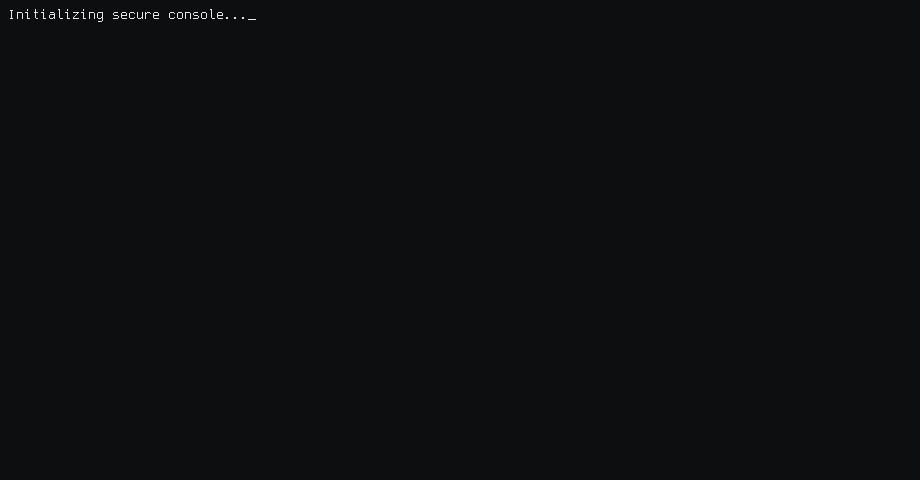

<h1 align="center">QiaoNPC</h1>

  
  
  

  

  

<h2>🛡️ CVEs</h2>

<table>
  <tr><th>CVE</th><th>Title</th></tr>
  <tr><td><a href="https://github.com/lin-snow/Ech0/security/advisories/GHSA-m983-7426-5hrj">CVE-2026-33638</a></td><td><a href="https://github.com/lin-snow/Ech0/security/advisories/GHSA-m983-7426-5hrj">Authenticated user-list exposed data via public <code>/api/allusers</code> endpoint</a></td></tr>
  <tr><td><a href="https://github.com/ShaneIsrael/fireshare/security/advisories/GHSA-7q8r-vpq3-89m7">CVE-2026-33645</a></td><td><a href="https://github.com/ShaneIsrael/fireshare/security/advisories/GHSA-7q8r-vpq3-89m7">Path Traversal Arbitrary File Write in <code>/api/uploadChunked</code></a></td></tr>
  <tr><td><a href="https://github.com/mrmn2/PdfDing/security/advisories/GHSA-42x7-vvj4-4cj3">CVE-2026-34376</a></td><td><a href="https://github.com/mrmn2/PdfDing/security/advisories/GHSA-42x7-vvj4-4cj3">Password-protected share bypass via direct serve endpoint</a></td></tr>
  <tr><td><a href="https://github.com/fccview/cronmaster/security/advisories/GHSA-9whh-mffv-xvh6">CVE-2026-34072</a></td><td><a href="https://github.com/fccview/cronmaster/security/advisories/GHSA-9whh-mffv-xvh6">Middleware authentication bypass enabling unauthorized page access and server-action execution</a></td></tr>
  <tr><td><a href="https://github.com/Erudika/scoold/security/advisories/GHSA-g5fv-xw88-vw44">CVE-2026-34832</a></td><td><a href="https://github.com/Erudika/scoold/security/advisories/GHSA-g5fv-xw88-vw44">Cross-Account Feedback Deletion (IDOR)</a></td></tr>
  <tr><td><a href="https://github.com/man-group/dtale/security/advisories/GHSA-436g-fhfc-9g5w">CVE-2026-35052</a></td><td><a href="https://github.com/man-group/dtale/security/advisories/GHSA-436g-fhfc-9g5w">Remote Code Execution through redis/shelf storage</a></td></tr>
  <tr><td><a href="https://github.com/MGeurts/genealogy/security/advisories/GHSA-2rq7-jqm7-w8x4">CVE-2026-39355</a></td><td><a href="https://github.com/MGeurts/genealogy/security/advisories/GHSA-2rq7-jqm7-w8x4">Missing Authorization in <code>TeamController::transferOwnership()</code> Allows Any Authenticated User to Hijack Any Team (Broken Access Control)</a></td></tr>
  <tr><td><a href="https://github.com/monetr/monetr/security/advisories/GHSA-hqxq-hwqf-wg83">CVE-2026-39901</a></td><td><a href="https://github.com/monetr/monetr/security/advisories/GHSA-hqxq-hwqf-wg83">Protected Transactions Deletable via PUT</a></td></tr>
  <tr><td><a href="https://github.com/mauriceboe/TREK/security/advisories/GHSA-wxx3-84fc-mrx2">CVE-2026-40184</a></td><td><a href="https://github.com/mauriceboe/TREK/security/advisories/GHSA-wxx3-84fc-mrx2">Unauthenticated Access to Uploaded Files in TREK</a></td></tr>
  <tr><td><a href="https://github.com/mauriceboe/TREK/security/advisories/GHSA-pcr3-6647-jh72">CVE-2026-40185</a></td><td><a href="https://github.com/mauriceboe/TREK/security/advisories/GHSA-pcr3-6647-jh72">Missing Authorization on Immich Trip Photo Routes in TREK</a></td></tr>
</table>

<h2>🎓 Conducted Workshops</h2>

<table>
  <tr><th>#</th><th>Workshop</th><th>Repo</th></tr>
  <tr><td>1</td><td>FSECSS – AttackTheCloud</td><td><a href="https://github.com/QiaoNPC/FSECSS-AttackTheCloud-Workshop">FSECSS-AttackTheCloud-Workshop</a></td></tr>
  <tr><td>2</td><td>CSLU – PwnDroid</td><td><a href="https://github.com/QiaoNPC/CSLU_PwnDroid_Workshop">CSLU_PwnDroid_Workshop</a></td></tr>
  <tr><td>3</td><td>GDGoC – PwnMobile</td><td><a href="https://github.com/QiaoNPC/GDGoC-PwnMobile-Workshop-Materials">GDGoC-PwnMobile-Workshop-Materials</a></td></tr>
  <tr><td>4</td><td>GDSC – PwnAI</td><td><a href="https://github.com/QiaoNPC/GDSC-PwnAI-Workshop-Materials">GDSC-PwnAI-Workshop-Materials</a></td></tr>
</table>

<h2>📝 CTF Writeups</h2>

<table>
  <tr><th>Year</th><th>Category</th><th>Link</th></tr>

  <tr><td>2025</td><td>SHERPACTF</td><td><a href="https://qiaonpc.github.io/categories/sherpactf-2025/">sherpactf-2025</a></td></tr>
  <tr><td>2025</td><td>SUNCTF</td><td><a href="https://qiaonpc.github.io/categories/sunctf-2025/">sunctf-2025</a></td></tr>
  <tr><td>2025</td><td>NO HACK NO CTF</td><td><a href="https://qiaonpc.github.io/categories/no-hack-no-ctf-2025/">no-hack-no-ctf-2025</a></td></tr>
  <tr><td>2025</td><td>CYDES QUALIFICATIONS</td><td><a href="https://qiaonpc.github.io/categories/cydes-qualifications-2025/">cydes-qualifications-2025</a></td></tr>
  <tr><td>2025</td><td>MALTACTF</td><td><a href="https://qiaonpc.github.io/categories/maltactf-2025/">maltactf-2025</a></td></tr>
  <tr><td>2025</td><td>NUS GREYHATS</td><td><a href="https://qiaonpc.github.io/categories/nus-greyhats-2025/">nus-greyhats-2025</a></td></tr>
  <tr><td>2025</td><td>NETSA CTF</td><td><a href="https://qiaonpc.github.io/categories/netsa-ctf-2025/">netsa-ctf-2025</a></td></tr>

  <tr><td>2024</td><td>MCC</td><td><a href="https://qiaonpc.github.io/categories/mcc-2024/">mcc-2024</a></td></tr>
  <tr><td>2024</td><td>SHERPACTF</td><td><a href="https://qiaonpc.github.io/categories/sherpactf-2024/">sherpactf-2024</a></td></tr>
  <tr><td>2024</td><td>PWC HACKADAY</td><td><a href="https://qiaonpc.github.io/categories/pwc-hackaday-2024/">pwc-hackaday-2024</a></td></tr>
  <tr><td>2024</td><td>SUNCTF</td><td><a href="https://qiaonpc.github.io/categories/sunctf-2024/">sunctf-2024</a></td></tr>
  <tr><td>2024</td><td>FSIIECTF</td><td><a href="https://qiaonpc.github.io/categories/fsiiectf-2024/">fsiiectf-2024</a></td></tr>
  <tr><td>2024</td><td>IHACK PRELIM</td><td><a href="https://qiaonpc.github.io/categories/ihack-prelim-2024/">ihack-prelim-2024</a></td></tr>
  <tr><td>2024</td><td>RENTAS RAWSEC CTF</td><td><a href="https://qiaonpc.github.io/categories/rentas-rawsec-ctf-2024/">rentas-rawsec-ctf-2024</a></td></tr>

  <tr><td>2023</td><td>STUDENT WARGAMES</td><td><a href="https://qiaonpc.github.io/categories/student-wargames-2023/">student-wargames-2023</a></td></tr>
  <tr><td>2023</td><td>ABOH</td><td><a href="https://qiaonpc.github.io/categories/aboh-2023/">aboh-2023</a></td></tr>
  <tr><td>2023</td><td>PETRONAS INTERUNIVERSITY CTF</td><td><a href="https://qiaonpc.github.io/categories/petronas-interuniversity-ctf-2023/">petronas-interuniversity-ctf-2023</a></td></tr>
</table>

